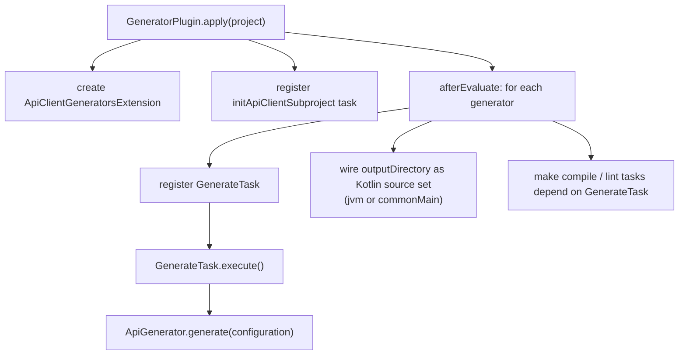

# AI Context — OpenAPI Ktor Client Generator

> Codebase analysis for AI agents. Keep this file up-to-date after significant changes.

---

## Module Structure

```
openapi-ktor-client-generator/
├── shared/                       → Common string/collection utilities (capitalize, snakeToCamelCase, …)
├── generator/                    → Core code generation engine (hexagonal architecture)
├── gradle-plugin/                → Gradle plugin integration layer
├── module/
│   ├── unknown-enum-value/       → Optional module: unknown enum value handling
│   ├── logging-sl4j/             → Optional module: SLF4J logging
│   └── logging-kotlin/           → Optional module: kotlin-logging (oshai) logging
├── convention/                   → Build convention plugins
├── e2e/                          → End-to-end test project (single-module, inline generation)
├── e2e-split/                    → E2E test for initApiClientSubproject (split-by-client mode)
├── settings.gradle.kts
└── build.gradle.kts
```

---

## `e2e-split/` — Split-by-client E2E Smoke Test

A standalone Gradle project that verifies the full `initApiClientSubproject` + compile flow for
split-by-client mode with `SHARED_PER_GROUP` granularity.

**Key files:**
- `src/main/openapi/sample.json` — minimal two-tag spec (`user`, `order`) with 4 operations and
  shared response models (`UserResponse`, `OrderResponse`) to exercise per-group shared subprojects.
- `settings.gradle.kts` — includes `mavenLocal()` in `pluginManagement` so generated submodules
  resolve the plugin version published locally. The `// <openapi-ktor-generated-includes>` marker
  block is committed **empty** (no `include(...)` inside). Gradle 9.4+ requires included project
  directories to exist at configuration time; since `initApiClientSubproject` creates those
  directories at task-execution time, committing pre-filled includes would fail on a fresh checkout.
  The task writes the `include(...)` statement into the marker block after creating the directories.
- `build.gradle.kts` — applies the generator plugin (`version "main-SNAPSHOT"`) to register
  the `initApiClientSubproject` task. Also declares `alias(e2e.plugins.kotlin.jvm) apply false`
  and `alias(e2e.plugins.kotlin.multiplatform) apply false` to register Kotlin plugin versions
  for subprojects (avoids classpath conflict in multi-project builds). Versions come from the
  version catalog defined in `settings.gradle.kts`.

**How to run locally:**
```bash
# 1. Publish plugin to Maven Local
./gradlew publishToMavenLocal

# 2. Generate split subproject (creates client/ directory with all submodules)
cd e2e-split
./gradlew initApiClientSubproject \
  -PopenApiFile=src/main/openapi/sample.json \
  -PsplitByClient=true \
  -PbasePackage=org.litote.sample \
  -PsplitGranularity=BY_TAG_AND_OPERATION \
  -PsharedModelGranularity=SHARED_PER_GROUP \
  -PsubprojectRootDirectory=client

# 3. Build generated subproject (compiles all generated modules)
./gradlew build
```

**What the init task generates (inside `client/`):**
- `client/shared/` — `ClientConfiguration`
- `client/shared-<group>/` — models shared between a specific pair of operation clients
  (e.g. `UserResponse` shared between `UserGetUsersClient` and `UserPostUsersClient`)
- `client/<operation>-client/` — one module per operation (BY_TAG_AND_OPERATION)

---

## Test Locations

| What to test | Where to add the test |
|---|---|
| Generator logic (parser + renderer, end-to-end) | `generator/src/test/kotlin/` — root generator module |
| Gradle plugin tasks | `gradle-plugin/src/test/kotlin/` |
| Optional modules | `module/<module-name>/src/test/kotlin/` |

> The sub-modules (`generator:domain`, `generator:adapter-parser`, etc.) have **no direct test sources**.
> They are covered by the integration tests in the root `generator` module, which exercises the full pipeline.

## Generated Files — Do Not Edit

The following files are generated automatically and must never be edited manually:

| File | Generated by |
|---|---|
| `gradle-plugin/src/main/kotlin/PluginVersion.kt` | Build task from `gradle/libs.versions.toml` |
| `e2e/build/generated/**` | `GenerateTask` during `./gradlew build` in `e2e/` |
| `e2e-split/client/**` | `initApiClientSubproject` task |

---

## Generator Module (`generator/`) — Hexagonal Architecture (Gradle-enforced)

The `generator` module is split into **7 Gradle sub-modules**. Dependency violations cause
compile errors, not just warnings.

### Gradle Dependency Graph

See [CONTRIBUTING.md — Gradle Dependency Graph](CONTRIBUTING.md#gradle-dependency-graph-enforced-at-compile-time).

### Sub-module Contents

| Sub-module | Root package | Key classes |
|---|---|---|
| `generator:domain` | `*.domain` | `GenerationSpec`, `ClientSpec`, `OperationSpec`, `ModelSpec` (sealed), `SubtypeHint`, `DomainTypeSpec` (sealed), `ModelPropertySpec`, `OperationParameterSpec`, `RequestBodySpec`, `ResponseEntrySpec`, `FormFieldSpec`, `ClientConfigurationSpec`, `SecuritySchemeSpec`, `ComponentParameterSpec`, `DefaultValueSpec`, `OperationMetaSpec`, `ParameterLocationSpec`, `ModelUsageAnalyzer` (top-level fns), `PartitionedGenerationSpec`, `PerClientGenerationSpec`, `SharedGroupSpec`, `GeneratedFileSpec` |
| `generator:port` | `*.port` | `ApiSpecificationParser` (parse takes only `operationFilter`), `ApiConfigurationRenderer`, `ApiClientRenderer`, `ApiModelRenderer`, `ApiFileSystemWriter`, `ApiConfigurationGeneratorConfig`, `ApiClientGeneratorConfig`, `ApiModelGeneratorConfig` |
| `generator:config` | `*.generator` | `ApiGeneratorConfiguration`, `ApiGeneratorModule`, `GenerationResult`, `SplitGranularity`, `SharedModelGranularity` |
| `generator:application` | `*.application` | `GenerateCodeService`, `GenerationSpecPartitioner` |
| `generator:adapter-writer` | `*.adapter.writer` | `KotlinPoetFileWriter` |
| `generator:adapter-parser` | `*.adapter.parser` | `OpenApiSpecificationParser(configuration)`, `ApiModel`, `TypeNameConverter`, `ParserNames`, `ParserTypes`, `ApiOperation`, `ApiClassProperty` |
| `generator:adapter-renderer` | `*.adapter.renderer` | `ApiClientGenerator`, `ApiModelGenerator`, `ApiClientConfigurationGenerator`, `YamlContentConverterGenerator`, `OperationBuilder`, `ResponseBuilder`, `KotlinPoets`, `KtorPoets` |
| `generator` (root) | `*.generator` | `ApiGenerator.kt` — composition root, the ONLY file importing all layers |

### Architectural Invariants and Port Design

See [CONTRIBUTING.md — Key Architectural Invariants](CONTRIBUTING.md#key-architectural-invariants-gradle-enforced) and [ApiSpecificationParser Port Design](CONTRIBUTING.md#apispecificationparser-port-design).

---

## Public API (`ApiGenerator.kt`)

```kotlin
// Main entry point — generates everything (or a split portion when splitByClient=true)
fun generate(configuration: ApiGeneratorConfiguration): GenerationResult

// Returns the list of client class names parsed from an OpenAPI spec (used by InitSubprojectTask)
fun parseClientNames(openApiFilePath: String, splitGranularity: SplitGranularity = BY_TAG): List<String>

// Returns all shared client groups (models shared between a specific set of clients)
fun parseSharedClientGroups(openApiFilePath: String, splitGranularity: SplitGranularity = BY_TAG): List<SharedClientGroup>

// Computes the direct Gradle compile-time dependency graph between per-group shared subprojects
fun computeSharedGroupDependencies(openApiFilePath: String, splitGranularity: SplitGranularity = BY_TAG): Map<SharedClientGroup, Set<SharedClientGroup>>

data class SharedClientGroup(
    val clientGroup: Set<String>,          // exact set of clients sharing these models
    val modelNames: Set<String>,           // names of all model classes in this group
) {
    val directoryName: String              // computed: e.g. "shared-order-user"
    val packageSuffix: String             // computed: e.g. "sharedOrderUser"
}

data class ApiGeneratorConfiguration(
    val openApiFile: String,
    val outputDirectory: String,
    val basePackage: String = "org.example",
    val operationFilter: (OperationMetaSpec) -> Boolean = { true },
    val modelPackage: String = "$basePackage.model",
    val clientPackage: String = "$basePackage.client",
    val modules: List<ApiGeneratorModule> = emptyList(),
    // Split-by-client mode:
    val splitByClient: Boolean = false,
    val targetClientName: String? = null,      // null = generate shared; "Foo" = generate FooClient + private models
    val sharedBasePackage: String? = null,      // base package of the shared subproject
    // Granularity features:
    val splitGranularity: SplitGranularity = BY_TAG,
    val sharedModelGranularity: SharedModelGranularity = SHARED_ALL,
    val targetSharedGroup: Set<String>? = null, // generate only models for this client group
    val modelPackageOverrides: Map<String, String> = emptyMap(), // model name → package
)
```

### `SplitGranularity` — Client split granularity

Controls the key used to group OpenAPI operations into clients:

| Value | Key | Example client name |
|-------|-----|---------------------|
| `BY_TAG` (default) | tag | `UserClient` |
| `BY_TAG_AND_PATH` | tag + sanitized path | `UserGetV1UsersIdClient` |
| `BY_TAG_AND_OPERATION` | tag + path + method | `UserGetV1UsersIdGetClient` |

### `SharedModelGranularity` — Shared model granularity

Controls how models shared by multiple clients are grouped:

| Value | Behavior |
|-------|----------|
| `SHARED_ALL` (default) | All shared models go to one `shared/` subproject |
| `SHARED_PER_GROUP` | Models are grouped by the exact set of clients using them; each unique group gets its own subproject (e.g. `shared-order-user/`) |

### Split-by-client generation logic

When `splitByClient = true`:
1. Parse the full spec
2. `GenerationSpecPartitioner.partition(spec)` → `PartitionedGenerationSpec` (always computes per-group sharedGroups)
3. Then **exactly one** of the following branches runs based on the configuration:
   - `targetClientName == null` **and** `targetSharedGroup == null` → generate global shared (ClientConfiguration + orphan/global models)
   - `targetSharedGroup == Set("OrderClient","UserClient")` → generate shared models for that exact client group only
   - `targetClientName == "FooClient"` → generate FooClient + models used ONLY by FooClient, no config

Model placement rules:
- Used by 2+ clients → shared (SHARED_ALL) or per-group subproject (SHARED_PER_GROUP)
- Used by exactly 1 client → that client's subproject
- Used by 0 clients (orphan) → global shared
- If a SealedClass is shared → all its subtypes are shared too (propagated)

### `modelPackageOverrides`

Map of model name → package to use when generating type references. Applied in both `ApiModelGenerator` (model property types) and `OperationBuilder`/`ResponseBuilder` (client method types). Used when models live in different subprojects with different packages.

---

## Gradle Plugin (`gradle-plugin/`)

### Key files

| File | Role |
|------|------|
| `GeneratorPlugin.kt` | `Plugin<Project>` — registers tasks, wires source sets |
| `ApiClientGeneratorsExtension.kt` | Root DSL: `apiClientGenerator { generators { }; skip; initSubproject { } }` |
| `ApiClientGenerator.kt` | Per-generator DSL: `openApiFile`, `outputDirectory`, `basePackage`, `allowedPaths`, `modulesIds`, `skip`, `splitGranularity`, `sharedModelGranularity`, `targetSharedGroup`, `additionalSharedGroupPackages` |
| `GenerateTask.kt` | `@CacheableTask` — calls `generate(ApiGeneratorConfiguration)` |
| `InitSubprojectTask.kt` | Generates a new Gradle subproject from an OpenAPI spec |
| `InitSubprojectExtension.kt` | DSL for `initSubproject { }`: version overrides (`kotlinVersion`, `ktorVersion`, …), `buildScriptTemplate`, `generatorConfigExtra`, `multiplatform` (KMP mode), `subprojectRootDirectory` |

### Plugin flow



### Generated output layout

**Default (`splitByClient = false`)**:
```
outputDirectory/
└── src/main/kotlin/
    ├── {basePackage}/client/
    │   ├── ClientConfiguration.kt
    │   ├── UserClient.kt
    │   └── ProductClient.kt
    └── {basePackage}/model/
        ├── User.kt
        └── Status.kt
```

**Split mode (`splitByClient = true`, `targetClientName = null` → shared subproject)**:
```
outputDirectory/
└── src/main/kotlin/
    ├── {basePackage}/client/ClientConfiguration.kt
    └── {basePackage}/model/SharedModel.kt
```

**Split mode (`splitByClient = true`, `targetClientName = "UserClient"` → client subproject)**:
```
outputDirectory/
└── src/main/kotlin/
    ├── {basePackage}/client/UserClient.kt
    └── {basePackage}/model/UserPrivateModel.kt
```

### initApiClientSubproject

```bash
# Single subproject
./gradlew initApiClientSubproject -PopenApiFile=./specs/petstore.json [-PsubprojectName=petstore]

# Multi-module (one subproject per client) — default BY_TAG granularity
./gradlew initApiClientSubproject -PopenApiFile=./specs/petstore.json -PsplitByClient=true

# Multi-module with split granularity
./gradlew initApiClientSubproject -PopenApiFile=./specs/petstore.json -PsplitByClient=true -PsplitGranularity=BY_TAG_AND_PATH

# Multi-module with per-group shared models
./gradlew initApiClientSubproject -PopenApiFile=./specs/petstore.json -PsplitByClient=true -PsharedModelGranularity=SHARED_PER_GROUP
```

**Single subproject** generates:
```
{name}/
├── build.gradle.kts   ← kotlin-jvm + serialization + plugin + ktor deps + apiClientGenerator block
└── src/main/openapi/
    └── {spec}.json
```

**Multi-module SHARED_ALL** (`-PsplitByClient=true`) generates:
```
{name}/
├── settings.gradle.kts   ← rootProject.name = "{name}" + include("shared", "userClient", …)
├── build.gradle.kts      ← empty
├── src/main/openapi/{spec}.json
├── shared/build.gradle.kts          ← splitByClient=true, no targetClientName, basePackage set
└── {clientNameLower}/build.gradle.kts  ← splitByClient=true, targetClientName=OriginalName, api(project(":shared"))
```

**Multi-module SHARED_PER_GROUP** (`-PsplitByClient=true -PsharedModelGranularity=SHARED_PER_GROUP`) generates:
```
{name}/
├── settings.gradle.kts   ← include("shared", "shared-order-user", "orderClient", "userClient", …)
├── shared/build.gradle.kts              ← global shared (ClientConfiguration + orphan models)
├── shared-order-user/build.gradle.kts   ← models used by both OrderClient and UserClient
├── orderClient/build.gradle.kts         ← api(project(":shared")) + api(project(":shared-order-user"))
└── userClient/build.gradle.kts          ← api(project(":shared")) + api(project(":shared-order-user"))
```

Key points:
- Client directory names start with **lowercase** (`userClient`, not `UserClient`)
- All subprojects use the **same `basePackage`** derived from the spec filename (e.g. `org.example.petstore`) for cross-reference consistency
- Per-group shared subproject directory: sorted client names (strip "Client" suffix, lowercase, join with `-`), e.g. `shared-order-user`
- Per-group shared package suffix: camelCase of directory name, e.g. `sharedOrderUser`
- Use `includeBuild("{name}")` in the parent `settings.gradle.kts` (NOT `include`)
- Or run standalone: `cd {name} && ./gradlew build`

---

## `shared/` Module

Provides pure Kotlin utility functions (no framework deps):
- `Strings.kt`: `capitalize()`, `uncapitalize()`, `snakeToCamelCase()`, `tagToCamelCase()`, `toUpperSnakeCase()`, `sanitizeToIdentifier()`, `ensureEndsWith()`
- `Collections.kt`: `toOrNull()`

Used by both `generator/` and `gradle-plugin/`.

---

## Module System (SPI)

See [README.md — Modules](README.md#modules) for the full module documentation and hook reference.

Built-in module IDs: `"UnknownEnumValueModule"`, `"LoggingSl4jModule"`, `"LoggingKotlinModule"`, `"BasicAuthModule"`.
Hooks are declared on `ApiConfigurationGeneratorConfig`, `ApiClientGeneratorConfig`, `ApiModelGeneratorConfig`.

> ⚠️ **Every new module must be added as an `implementation` dependency in `gradle-plugin/build.gradle.kts`** — otherwise the SPI `ServiceLoader` cannot find it at runtime when the plugin is applied. Currently declared: `module:unknown-enum-value`, `module:logging-kotlin`, `module:logging-sl4j`, `module:basic-auth`.

`ApiConfigurationGeneratorConfig` exposes:
- `jsonDefaultValueProperties: MutableMap<String, String>` — add/modify Json builder properties
- `exceptionLoggingDefaultValue: String` — replace the exception logger lambda
- `httpClientAuthorizationDefaultValue: String` — lambda body for the `httpClientAuthorization` constructor parameter (default `"{}"`)
- `additionalStringParameters: MutableList<String>` — param names (type `String?`, default `null`) injected before `httpClientAuthorization` in the constructor; referenced by name inside `httpClientAuthorizationDefaultValue` lambdas
- `logLevelDefaultValue: String` — default value for the `logLevel: LogLevel` constructor parameter (default `"LogLevel.HEADERS"`, matching Ktor's own default)

`BasicAuthModule` adds `accessToken: String?` and sets `httpClientAuthorization` to `{ accessToken?.let { token -> defaultRequest { header("Authorization", "Bearer " + token) } } }`.

---

## Quality Gate (SonarCloud)

The project uses SonarCloud for static analysis with a strict **0 issues** quality gate.

### Running the full quality loop

```bash
./gradlew check jacocoAggregatedReport sonar sonarCheck
```

- `check` — compiles + runs all tests + generates per-module JaCoCo `.exec` files
- `jacocoAggregatedReport` — merges all `.exec` into `build/reports/jacoco/jacocoAggregatedReport/jacocoAggregatedReport.xml`
- `sonar` — sends analysis + aggregated coverage to SonarCloud
- `sonarCheck` — **calls the SonarCloud API** to verify gate status, issues count, and hotspot count; **fails the build** if any is non-zero

> ⚠️ **MANDATORY before finalizing any task**: `sonarCheck` must exit with `BUILD SUCCESSFUL`.
> If it fails, fix all reported issues before marking the task done.

### `sonarCheck` task

The `sonarCheck` Gradle task (registered in root `build.gradle.kts`) calls three SonarCloud API endpoints:

| Endpoint | What it checks |
|----------|----------------|
| `/api/qualitygates/project_status` | Quality gate status must be `OK` |
| `/api/issues/search?resolved=false` | Total open issues must be `0` |
| `/api/hotspots/search?status=TO_REVIEW` | Unreviewed security hotspots must be `0` |

It prints a summary box and fails with a clear error message listing each violation.

### Token setup

Add to `~/.gradle/gradle.properties` (never commit):
```
systemProp.sonar.token=<your-token>
```

### Project

- **Project key**: `Litote_openapi-ktor-client-generator`
- **Organization**: `litote`
- **URL**: https://sonarcloud.io/project/overview?id=Litote_openapi-ktor-client-generator

### Coverage notes

- JaCoCo is applied to all modules via `kotlin-convention.gradle.kts`
- The aggregated report covers all sub-modules (including `adapter-parser`, `adapter-renderer`, etc.) which have no direct tests but are exercised by `generator` tests
- `sonar.coverage.jacoco.xmlReportPaths` is set per-subproject to point to the root aggregated report
- Files at the root of `src/main/kotlin/` (e.g. `ApiGenerator.kt`) produce "File not found in project sources" warnings — this is a known Sonar/JaCoCo limitation with the Kotlin "common root omitted" convention; the code analysis is not affected

---

## Multipart Binary Fields — `Content-Disposition` with `filename`

When a multipart form field has type `string/binary` (i.e. a file upload), the generator:

1. Creates a `*FormFile` data class with three fields: `bytes: ByteArray`, `contentType: ContentType`, `filename: String = "upload"`
2. Uses `Headers.build { }` (not `headersOf`) to set both `ContentType` and `ContentDisposition` headers:

```kotlin
append("file", form.file.bytes, Headers.build {
  append(HttpHeaders.ContentType, form.file.contentType.toString())
  append(HttpHeaders.ContentDisposition, "form-data; name=\"file\"; filename=\"" + form.file.filename + "\"")
})
```

Key implementation points (`OperationBuilder.kt`):
- `headersClass = ClassName(KTOR_HTTP, "Headers")` — uses `Headers.build { }` closure
- `httpHeadersClass = ClassName(KTOR_HTTP, "HttpHeaders")` — for `ContentType` and `ContentDisposition` constants
- `buildFormFileType()` — generates the `*FormFile` data class with the `filename` field
- `appendFormPart()` — generates the `append(...)` call with `Headers.build { }` block using `indent()/unindent()`

---

## Domain Model — `GenerationSpec` Structure


**`DomainTypeSpec.ModelReferenceSpec(name)`** is the link between operations/models and named model classes generated in the model package.

---

## allOf with `$ref` — Interface Generation

See [CONTRIBUTING.md — allOf-only schemas → Kotlin interface](CONTRIBUTING.md#allof-only-schemas--kotlin-interface).

> ⚠️ **`ModelUsageAnalyzer.kt` — `collectModelRefs(DataClassSpec)` maintenance rule**
>
> Every relationship stored in `DataClassSpec` that points to another named model **must** be listed in `collectModelRefs(DataClassSpec)` (in `ModelUsageAnalyzer.kt`). If a new field referencing another model is added to `DataClassSpec`, add it here too — otherwise the referenced model will have an empty client set, be treated as an orphan, and never generated in split-by-client mode, causing "Unresolved reference" compile errors.
>
> Current relationships collected:
> - `sealedParentName` — the sealed class this data class extends
> - `interfaceParentNames` — the interfaces this data class implements (via `allOf $ref`)
> - property types (via `collectModelRefs(DomainTypeSpec)`)
> - nested model types inside properties

---

## Response `oneOf` — Polymorphic Sealed Classes

See [CONTRIBUTING.md — Response oneOf — Polymorphic Sealed Classes](CONTRIBUTING.md#response-oneOf--polymorphic-sealed-classes).

Key classes: `SubtypeHint` (domain), `ApiModel.responseSealedParents`, `ApiModelGenerator.buildPolymorphicSerializerCompanion`.

---

## Version Constants for initApiClientSubproject gradle task

Generated at build time from `gradle/libs.versions.toml` into `gradle-plugin/src/main/kotlin/PluginVersion.kt`.
**Do not edit `PluginVersion.kt` manually** — it is overwritten on every build.

Constants generated:
- `DEFAULT_KOTLIN_VERSION`
- `DEFAULT_KTOR_VERSION`
- `DEFAULT_COROUTINES_VERSION`
- `DEFAULT_SERIALIZATION_VERSION`
- `PLUGIN_VERSION`

### Extra dependencies and KMP targets in generated build scripts

`InitSubprojectExtension` (and `InitSubprojectTask`) expose two generic list properties:
- `additionalDependencies: ListProperty<String>` — each entry is a `group:artifact:version` coordinate
  added as an `implementation(...)` entry in all generated `build.gradle.kts` files.
- `additionalTargets: ListProperty<String>` — each entry is a raw Kotlin DSL expression (e.g.
  `"js(IR) { browser() }"`) added inside the `kotlin { }` block when `multiplatform = true`.

Example — adding `kotlin-logging` for use with `LoggingKotlinModule`:
```kotlin
apiClientGenerator {
    initSubproject {
        multiplatform.set(true)
        generatorConfigExtra.set("""modulesIds = setOf("LoggingKotlinModule")""")
        additionalDependencies.add("io.github.oshai:kotlin-logging:<version>")
    }
}
```

---

## CI / CD

See [CONTRIBUTING.md — CI / CD](CONTRIBUTING.md#ci--cd) for the full workflow documentation, release flow, secrets, and Conventional Commits rules.
