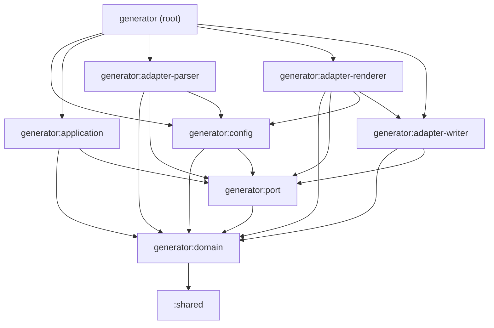

## Prerequisites

- JDK 17+
- Gradle 9.4.0+

## Quick Reference

```bash
# MANDATORY after every code change:
./gradlew clean formatKotlin && ./gradlew check

# Run specific tests:
./gradlew :generator:test
./gradlew :generator:test --tests "*.ParsingTests"

# E2E testing (separate project):
./gradlew publishToMavenLocal
cd e2e && ./gradlew build

# Debug:
./gradlew build --info
```

## Module Architecture

```
shared/                         → Shared abstractions (utilities)
generator/                      → Composition root — wires all sub-modules together
  generator:domain              → Pure domain model (zero external dependencies)
  generator:port                → Port interfaces (inward & outward contracts)
  generator:config              → Public API types (ApiGeneratorConfiguration, ApiGeneratorModule, GenerationResult)
  generator:application         → Orchestration services (no adapter imports)
  generator:adapter-writer      → File system writer adapter
  generator:adapter-parser      → OpenAPI specification parser adapter
  generator:adapter-renderer    → Kotlin/KotlinPoet code renderer adapter
gradle-plugin/                  → Gradle integration (GeneratorPlugin, tasks)
module/unknown-enum-value/      → Handles unmapped enum values
module/logging-sl4j/            → SLF4J logging in generated clients
module/logging-kotlin/          → kotlin-logging (oshai) logging in generated clients
convention/                     → Build convention plugins
e2e/                            → End-to-end tests (separate Gradle project)
```
---


## Generator Architecture

The `generator` module follows a **hexagonal architecture** (ports & adapters) enforced by
Gradle sub-module boundaries. Adding an illegal dependency (e.g. KotlinPoet in `domain`) causes
a **compile error**, not just a lint warning.

### Gradle Dependency Graph (enforced at compile time)



### Sub-module Contents

| Sub-module | Root package | Key classes |
|---|---|---|
| `generator:domain` | `*.domain` | `GenerationSpec`, `ClientSpec`, `ModelSpec`, all domain `*Spec` types |
| `generator:port` | `*.port` | `ApiSpecificationParser`, `ApiClientRenderer`, `ApiModelRenderer`, `ApiConfigurationRenderer`, `ApiFileSystemWriter`, `Api*GeneratorConfig` interfaces |
| `generator:config` | `*.generator` | `ApiGeneratorConfiguration`, `ApiGeneratorModule`, `GenerationResult`, `SplitGranularity`, `SharedModelGranularity` |
| `generator:application` | `*.application` | `GenerateCodeService`, `GenerationSpecPartitioner` |
| `generator:adapter-writer` | `*.adapter.writer` | `KotlinPoetFileWriter` |
| `generator:adapter-parser` | `*.adapter.parser` | `OpenApiSpecificationParser`, `ApiModel`, `TypeNameConverter`, helpers |
| `generator:adapter-renderer` | `*.adapter.renderer` | `ApiClientGenerator`, `ApiModelGenerator`, `ApiClientConfigurationGenerator`, builders, helpers |
| `generator` (root) | `*.generator` | `ApiGenerator.kt` — the only file that imports all layers |

### Key Architectural Invariants (Gradle-enforced)

- **`generator:domain`** compiles with **zero** KotlinPoet / OpenAPI bindings / Ktor / I/O dependencies
- **`generator:port`** depends only on `generator:domain` — no `ApiGeneratorConfiguration` in port interfaces
- **`generator:application`** cannot see adapter classes (not in its dependency graph)
- **`generator:adapter-parser`** cannot see renderer code (no `generator:adapter-renderer` dep)
- **`generator:adapter-renderer`** cannot see parser code (no `generator:adapter-parser` dep)
- The composition root `generator` is the **only** module that can wire all layers together

### `ApiSpecificationParser` Port Design

`ApiSpecificationParser.parse(operationFilter)` receives **only** a domain-typed filter.
The full `ApiGeneratorConfiguration` is injected into `OpenApiSpecificationParser` at
**construction time** in the composition root, keeping the port free of config types.

```
ApiGenerator.kt (root)
  └─► OpenApiSpecificationParser(configuration)  ← adapter-parser
        .parse(configuration.operationFilter)     ← port method (no ApiGeneratorConfiguration here)
```


## Core Components Reference

| Component | Responsibility |
|-----------|----------------|
| `ApiClientConfigurationGenerator` | Generates `ClientConfiguration.kt` and (if YAML) `YamlContentConverter.kt` |
| `YamlContentConverterGenerator`   | Generates `YamlContentConverter.kt` — bridges YAML ↔ JSON via SnakeYAML |
| `OperationBuilder`                | Builds per-operation methods with correct `contentType()` headers |

## allOf with $ref — Property Flattening

When a schema uses `allOf` containing `$ref` entries, the parser resolves the referenced schemas
and merges their properties into the current schema (property flattening):

```json
"TextStatus": {
  "allOf": [
    { "$ref": "#/components/schemas/BaseStatus" },
    { "type": "object", "required": ["status"], "properties": { "status": { "type": "string" } } }
  ]
}
```

Generates a `TextStatus` data class that includes both its own properties **and** all properties
from `BaseStatus`. If `TextStatus` is also a sealed class subtype (via a `oneOf` request body),
it still extends the sealed parent — Kotlin single-inheritance is respected via flattening rather
than class inheritance from the `$ref` target.

---

## YAML Support

When an OpenAPI spec contains `application/yaml` or `application/x-yaml` content types (in request bodies or responses), the generator automatically:

1. Sets `ClientConfigurationSpec.hasYamlContentType = true` (detected in `OpenApiSpecificationParser`)
2. Generates `YamlContentConverter.kt` in the client package (`YamlContentConverterGenerator`)
3. Registers the converter in `ContentNegotiation` for both YAML content types (`ApiClientConfigurationGenerator`)
4. Sets `contentType(ContentType("application", "yaml"))` on operations with YAML request bodies (`OperationBuilder`)

The `YamlContentConverter` bridges YAML ↔ `kotlinx.serialization` via SnakeYAML:
- **Deserialize**: YAML bytes → SnakeYAML `Map/List` → `JsonElement` → `kotlinx.serialization`
- **Serialize**: `kotlinx.serialization` JSON string → SnakeYAML → YAML bytes

Users must add `org.yaml:snakeyaml` to their project dependencies when YAML endpoints are used.

---

## Coding conventions

### Follow [official kotlin conventions](https://kotlinlang.org/docs/coding-conventions.html)

### Directory structure mirrors package structure

Each **Gradle module** defines its own root package. Following the [Kotlin recommendation](https://kotlinlang.org/docs/coding-conventions.html#directory-structure), the module's root package is the *common root package* and is omitted from the directory path — all source files live directly under `src/main/kotlin/`.

| Module | Root package | Source files location |
|---|---|---|
| `generator:domain` | `org.litote.openapi.ktor.client.generator.domain` | `src/main/kotlin/` |
| `generator:port` | `org.litote.openapi.ktor.client.generator.port` | `src/main/kotlin/` |
| `generator:adapter-renderer` | `org.litote.openapi.ktor.client.generator.adapter.renderer` | `src/main/kotlin/` |
| `gradle-plugin` | `org.litote.openapi.ktor.client.generator.plugin` | `src/main/kotlin/` |
| `shared` | `org.litote.openapi.ktor.client.generator.shared` | `src/main/kotlin/` |

Sub-packages within a module are reflected as subdirectories only if the module itself contains files from multiple packages.

### [Choose good names](https://kotlinlang.org/docs/coding-conventions.html#choose-good-names) for classes

- do not suffix names with `Impl` or `ImplBase`, ou `Util`
- use `Api` prefix for interfaces
- use `Client` prefix for client classes
- use `Configuration` prefix for configuration classes
- use `Spec` prefix for domain types
- use `Builder` suffix for builders
- use `Converter` suffix for converters
- use `Generator` suffix for generators
- use `Parser` suffix for parsers
- use `Renderer` suffix for renderers
- for Util classes prefer `Files.kt` to `FileUtils.kt`

### Prefer top-level function to stateless object declaration

### Be consistant

If you use Spec suffix for domain types, use it for all domain types

## Update dependencies

```bash
# 1. Update version catalog to latest available versions
./gradlew versionCatalogUpdate

# 2. Regenerate dependency verification metadata (MANDATORY after any dependency change)
./gradlew updateVerificationMetadata
```

> ⚠️ **Always run `updateVerificationMetadata` after any dependency upgrade.**
> Skipping this step causes `Dependency verification failed` errors in IntelliJ and for other contributors.

The `updateVerificationMetadata` task rewrites `gradle/verification-metadata.xml` with fresh SHA-256
checksums for all resolved artifacts. It preserves the `trusted-artifacts` rules (sources JARs,
javadoc JARs, `.pom`, `.module` files) which are IDE-only and exempt from checksum verification.

## Publishing

```bash
# Maven 
./gradlew publish
# Gradle portal 
./gradlew publishPlugins
```

---

## CI / CD

Three GitHub Actions workflows are defined under `.github/workflows/`:

| Workflow | Trigger | What it does |
|---|---|---|
| `ci.yml` | Pull request → `main` | PR title (Conventional Commits), runs tests + Jacoco + SonarCloud PR analysis + quality gate |
| `ci.yml` | Push → `main` | Same as above (branch analysis) + deploys SNAPSHOT to Maven Central |
| `release-please.yml` | Push → `main` | Runs release-please: creates/updates the Release PR (CHANGELOG + manifest bump), then creates the GitHub Release + tag when the Release PR is merged. On release created, chains to the `publish` job |
| `release-please.yml` (`publish` job) | After release-please creates a release (or `workflow_dispatch`) | Checks out tag, sets `VERSION_NAME` locally, runs full QA, publishes to Maven Central + Gradle Plugin Portal (no commit) |

### Conventional Commits

All PR titles **must** follow the [Conventional Commits](https://www.conventionalcommits.org/) specification.
This is enforced automatically via `amannn/action-semantic-pull-request` in `ci.yml`.

#### Branch naming

PR branches should mirror the PR title using the same Conventional Commits type as prefix:

```
<type>/<short-kebab-description>

# Examples:
feat/yaml-content-type-support
fix/enum-null-value-parsing
chore/update-ktor-version
docs/contributing-branch-naming
refactor/split-renderer-module
```

Use the same types as for PR titles (`feat`, `fix`, `perf`, `chore`, `docs`, `test`, `refactor`, `ci`).
The description should be short, lowercase, and hyphen-separated.

| Type | Version bump | When to use |
|------|-------------|-------------|
| `feat:` | Minor (`0.3.0` → `0.4.0`) | New user-facing feature |
| `fix:` | Patch (`0.3.0` → `0.3.1`) | Bug fix |
| `perf:` | Patch | Performance improvement |
| `feat!:` / `BREAKING CHANGE:` | Major (`0.3.0` → `1.0.0`) | Breaking API change |
| `chore:`, `docs:`, `test:`, `refactor:`, `ci:` | No release | Internal changes |

> **Note:** While the major version is `0`, `feat:` commits bump the minor version (not major). This is controlled by `bump-minor-pre-major: true` in `release-please-config.json`.

### Release flow (automated)

```
feat/fix commit merged → main
        ↓
release-please.yml analyses commits
        ↓
Creates / updates the "Release PR"
(CHANGELOG.md update + manifest bump)
        ↓
Release PR merged
        ↓
release-please creates tag vX.Y.Z + GitHub Release
        ↓
publish job triggers (release_created=true)
→ Checks out tag, sets VERSION_NAME=X.Y.Z locally
→ Full QA → Maven Central → Gradle Plugin Portal
(no commit — version lives only in the tag)
```

### Signing

- **Artifact signing** (Maven Central): uses in-memory GPG signing in CI via `ORG_GRADLE_PROJECT_signingInMemoryKey*` env vars. Locally, uses `gpg --use-agent` (`useGpgCmd()`). Convention: `convention/src/main/kotlin/kotlin-convention.gradle.kts`.

### GitHub Secrets required

GitHub Secrets are always uppercased by GitHub. The workflow YAML maps each secret to the exact env var name expected by Gradle/vanniktech.

| GitHub Secret (what you type) | Env var injected by workflow | Used by |
|---|---|---|
| `SONAR_TOKEN` | `SONAR_TOKEN` | ci, snapshot, release |
| `MAVEN_CENTRAL_USERNAME` | `ORG_GRADLE_PROJECT_mavenCentralUsername` | snapshot, release |
| `MAVEN_CENTRAL_PASSWORD` | `ORG_GRADLE_PROJECT_mavenCentralPassword` | snapshot, release |
| `SIGNING_IN_MEMORY_KEY` | `ORG_GRADLE_PROJECT_signingInMemoryKey` | snapshot, release (key 1 — `release@litote.org`) |
| `SIGNING_IN_MEMORY_KEY_ID` | `ORG_GRADLE_PROJECT_signingInMemoryKeyId` | snapshot, release |
| `SIGNING_IN_MEMORY_KEY_PASSWORD` | `ORG_GRADLE_PROJECT_signingInMemoryKeyPassword` | snapshot, release |
| `GRADLE_PUBLISH_KEY` | `-Pgradle.publish.key` | release |
| `GRADLE_PUBLISH_SECRET` | `-Pgradle.publish.secret` | release |
| `RELEASE_PLEASE_APP_ID` | GitHub App ID | release-please |
| `RELEASE_PLEASE_APP_PRIVATE_KEY` | GitHub App private key | release-please |

### release-please GitHub App setup

release-please requires a GitHub App so that the `publish` job can be triggered reliably (GitHub's loop prevention blocks `GITHUB_TOKEN`-created events from triggering workflows).

1. Create a GitHub App with permissions: **Contents** (read & write), **Pull requests** (read & write)
2. Install it on the repository
3. Add `RELEASE_PLEASE_APP_ID` and `RELEASE_PLEASE_APP_PRIVATE_KEY` as repository secrets

### Triggering a release

Releases are **fully automated**. Merge PRs with Conventional Commits titles to `main`.
release-please accumulates commits and creates a Release PR. Merge the Release PR to trigger the release.

